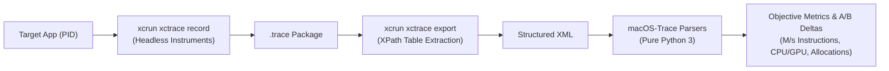

# macOS-Trace ⚡️

[](https://agentskills.io)
[](https://developer.apple.com/macos/)
[](https://developer.apple.com/xcode/)
[-3776AB.svg)](https://www.python.org/)
[](https://opensource.org/licenses/MIT)

> **Autonomous, headless profiling and objective A/B benchmarking for macOS applications using `xctrace` and Xcode Instruments.**

`macOS-Trace` is an open-standard [Agent Skill](https://agentskills.io) and CLI toolchain designed for **AI coding agents** (Claude Code, OpenAI Codex, Cursor, Google Antigravity, GitHub Copilot) and **macOS engineers**. It enables automated capture of system traces, headless data extraction from Instruments tables, and differential (A/B) performance analysis without manual GUI interaction.

---

## 🚀 Why macOS-Trace?

Profiling macOS applications using the Instruments GUI is powerful but manual and hard to automate in agentic coding loops. Traditional tools produce monolithic `.trace` bundles that LLMs cannot inspect directly.

`macOS-Trace` solves this by providing:
1. **Airtight Headless Workflow**: Capture `Power Profiler`, `Time Profiler`, and `Allocations` headlessly via `xcrun xctrace`.
2. **Tabular XML Extraction**: Target specific data tables (`ProcessSubsystemPowerImpact`, `all-allocations-summary`) using precise XPath selectors.
3. **Zero-Dependency Quantitative Parsers**: Pure Python 3 standard library scripts that summarize instruction throughput (M/s), CPU/Display/GPU impact, and memory allocation rates.
4. **Differential (A/B) Comparison Engine**: Automatically compute baseline deltas between optimization attempts to prove performance gains with empirical data.
5. **Domain-Specific Recipes**: Battle-tested optimization patterns for **Audio/DSP taps**, **Metal shaders**, **WebKit hybrid engines**, and **SwiftUI/AppKit views**.

---

## 📊 How It Works



---

## ⚡ Quick Start

### 1. Automated Run (One Command)

Use the included runner `scripts/run_trace.sh` to record, export, and parse in a single step:

```bash
# 1. Capture 60s idle baseline:
./scripts/run_trace.sh --process "MyApp" --template power --duration 60s --label "01-baseline-idle"

# 2. Trigger active workload in app, then capture active scenario:
./scripts/run_trace.sh --process "MyApp" --template power --duration 60s --label "02-active-workload"

# 3. Compare runs and compute delta:
python3 scripts/compare_elements.py \
  /tmp/macos-traces/01-baseline-idle-power.xml:"1. Baseline" \
  /tmp/macos-traces/02-active-workload-power.xml:"2. Active Workload"
```

**Output:**
```text
Scenario                    Sec  CPU Avg  CPU Max  Display  GPU Avg  Total Instr    Instr M/s
============================================================================================
1. Baseline                  60     0.15     0.80     0.05     0.00        1.02G         17.0
2. Active Workload           60     1.85     3.40     0.90     1.20       12.60G        210.0
--------------------------------------------------------------------------------------------
Differential vs Baseline [1. Baseline]:
  2. Active Workload           +193.0 M/s instructions, CPU Avg Δ +1.70
```

---

## 📦 Installation for AI Agents & Developers

### Option 1: Install into Project (Recommended for Repos)

Cloning into your project's agent skills directory makes it immediately discoverable by Claude Code, Codex, Cursor, and Antigravity:

```bash
# For projects using standard .agents/skills/
git clone https://github.com/kmgcc/macOS-Trace.git .agents/skills/macos-trace

# For Codex-specific projects:
git clone https://github.com/kmgcc/macOS-Trace.git .codex/skills/macos-trace

# As a Git submodule:
git submodule add https://github.com/kmgcc/macOS-Trace.git .agents/skills/macos-trace
```

### Option 2: Install Globally (Available across all workspaces)

```bash
# User-level agent skills (Claude Code / Cursor / Codex)
mkdir -p ~/.agents/skills
git clone https://github.com/kmgcc/macOS-Trace.git ~/.agents/skills/macos-trace

# Or for Codex global skills:
mkdir -p ~/.codex/skills
git clone https://github.com/kmgcc/macOS-Trace.git ~/.codex/skills/macos-trace
```

---

## 🛠 Included Tooling & Scripts

All helper scripts require **Python 3.8+** with **zero external pip dependencies** (standard library only: `re`, `sys`, `os`, `xml.etree.ElementTree`, `collections`).

| Script | Purpose | Example Usage |
| :--- | :--- | :--- |
| **`scripts/run_trace.sh`** | End-to-end headless runner (record + export + parse) | `./scripts/run_trace.sh --process MyApp --template power` |
| **`scripts/compare_elements.py`** | Multi-scenario comparative table + baseline delta | `python3 scripts/compare_elements.py idle.xml active.xml` |
| **`scripts/parse_power.py`** | Parse single Power Profiler impact XML | `python3 scripts/parse_power.py run-power.xml "Workload"` |
| **`scripts/top_categories.py`** | Analyze high-frequency Allocations categories | `python3 scripts/top_categories.py alloc.xml 60 10.0` |

---

## 🎯 Supported Instruments Templates

- **`Power Profiler`** (`power`): CPU instruction throughput (M/s), CPU/GPU/Display impact. Ideal for objective energy and performance benchmarking.
- **`Time Profiler`** (`time`): Call stack weights, main-thread blocking methods, UI hangs.
- **`Allocations`** (`alloc`): Heap allocations, transient memory spikes, category event rates.
- **`Leaks`** (`leaks`): Retained memory leaks and cycle detection.
- **`Metal System Trace`** (`metal`): GPU shader execution time, pipeline stalls, and frame synchronization.

---

## 💡 Subsystem Optimization Recipes

The [SKILL.md](SKILL.md) instructions contain practical, real-world recipes derived from native macOS audio/media players, graphics apps, and desktop utilities:

1. **Audio & DSP Taps**: Enforcing zero-heap-allocation in real-time CoreAudio threads; lock-free ring buffer dispatch for FFT spectrum meters.
2. **Metal Shaders & Visual FX**: Managing Retina display overdraw (2x/3x fill rate multiplier); auto-pausing display links on window occlusion (`NSWindowOcclusionState`).
3. **WebKit & Hybrid Architectures**: Mitigating IPC serialization bottleneck between Swift and JavaScript (`evaluateJavaScript`); DOM reflow optimization.
4. **SwiftUI & AppKit Desktop Views**: Eliminating sawtooth memory spikes by downsampling image thumbnails (`CGImageSourceCreateThumbnailAtIndex`); curing `@Observable` cascade body invalidation.

---

## 📋 Requirements & Prerequisites

- **Operating System**: macOS 12.0 (Monterey) or newer.
- **Xcode Command Line Tools**: `xctrace` is bundled with Xcode and Command Line Tools.
  ```bash
  xcode-select --install
  ```
- **Python**: Python 3.8+ (pre-installed on macOS).

---

## 📄 License

This project is licensed under the [MIT License](LICENSE).

Contributions, issue reports, and pull requests are warmly welcome!
